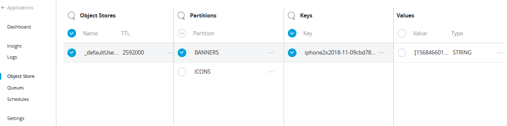

# CloudHub Partitionable ObjectStore
   

The recommended approach to implement a distributed cache in CloudHub, synchronized for all the workers, is to use the default CloudHub persistent Object Store (Using Object Store V2).
The [Mulesoft Knowledge Base][f338c593] article describes such solution and provide a sample implementation.

The implementation provided in the article, however, do not support partitions, so if we define multiple caches for different purposes all the entries will be stored in the same default partition.

The PartitionableMonitorObjectStore allows to use a different partition for each cache. This will offer a better experience when you need to search or manually expire a particular key.
The image below shows an example of how it will look like in the Runtime Manager console:    
<br/>


## Supported Mule Versions

- Mule 3.x

## Setup

As a dependency of your Maven project:

```xml
<dependency>
   <groupId>com.mariocairone.mule</groupId>
   <artifactId>cloudhub-partitionable-objectstore</artifactId>
   <version>1.0.0</version>
</dependency>
```

You can also build the `.jar` file yourself, assuming you have Maven and JDK 1.8+ installed:
```shell
mvn clean install
```

The resulting `.jar` file will be located in the `target/` folder.

You can also find `SNAPSHOT` builds of the latest and greatest changes to the master branch in the SonaType snapshots repository.

To add that snapshot repository to your Maven pom.xml use the following snippet:
```xml
<repositories>
    <repository>
        <id>oss-sonatype</id>
        <name>oss-sonatype</name>
        <url>https://oss.sonatype.org/content/repositories/snapshots/</url>
        <snapshots>
            <enabled>true</enabled>
        </snapshots>
    </repository>
</repositories>
```

## Configuration

### Parameters

| Name               | Required | Type                              | Default | Description                                                                                                                                                                                                                                                                                            |
|:-------------------|:---------|:----------------------------------|:--------|:-------------------------------------------------------------------------------------------------------------------------------------------------------------------------------------------------------------------------------------------------------------------------------------------------------|
| partition          | true     | String                            |         | The partition name                                                                                                                                                                                                                                                                                     |
| localObjectStore   | true     | PartitionableExpirableObjectStore |         | The object store instance                                                                                                                                                                                                                                                                              |
| entryTTL           | false    | Integer                           | -1      | The time-to-live for each entry, specified in milliseconds.If <em>-1</em> entries will never expire. <b>Do not combine this with an unbounded store!</b>                                                                                                                                               |
| maxEntries         | false    | Integer                           | 4000    | The maximum number of entries that this store keeps around. Specify <em>-1</em> if the store is supposed to be "unbounded".                                                                                                                                                                            |
| expirationInterval | false    | Integer                           | 1000    | The interval for periodic bounded size enforcement and entry expiration, specified in milliseconds.Arbitrary positive values between 1 millisecond and several hours or days are possible, but should be chosen carefully according to the expected message rate to prevent  out of memory conditions. |


### Example

```xml
<ee:object-store-caching-strategy  name="MyCacheStrategy"  doc:name="Caching Strategy" keyGenerationExpression="#[flowVars.cacheKey]">
	<custom-object-store class="com.mariocairone.mule.objectstore.PartitionableMonitorObjectStore">
		<spring:property name="partition" value="MY_PARTITION"/>
		<spring:property name="localObjectStore" ref="_defaultUserObjectStore"/>
		<spring:property name="entryTTL" value="${cache.entry.ttl}"/>
		<spring:property name="maxEntries" value="${cache.max.entries}"/>
		<spring:property name="expirationInterval" value="${cache.expiration.interval}"/>
	</custom-object-store>
</ee:object-store-caching-strategy>
```
[f338c593]: https://help.mulesoft.com/s/article/How-to-implement-a-distributed-cache-on-CloudHub-using-ObjectStore "Distributed Cache on CloudHub"
